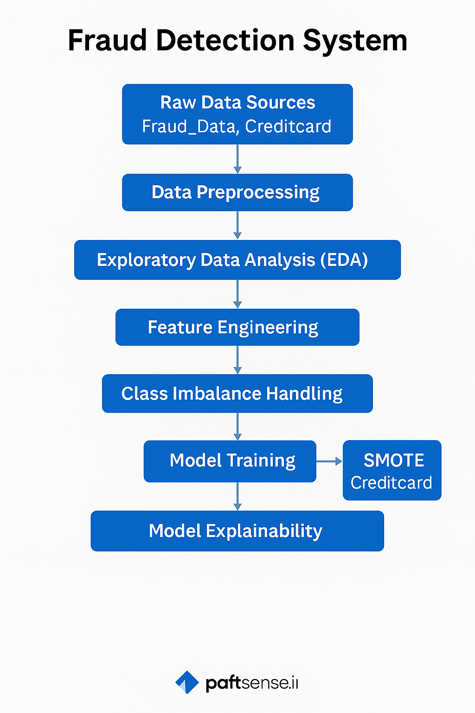

#  Fraud Detection Project

This project is developed as part of the 10 Academy Week 8–9 challenge to detect fraudulent online transactions using a combination of geolocation, behavioral, and temporal features. It involves full data preparation and modeling, with a focus on building a high-quality, reproducible ML pipeline.

--- 

## 🔄 Project Workflow: System Diagram

The overall system follows a modular ML data pipeline, with each step in its own notebook:

```
              ┌────────────────────────┐
              │    Raw Data Sources    │
              │ Fraud_Data, Creditcard │
              └──────────┬─────────────┘
                         │
                         ▼
     ┌──────────────────────────────┐
     │ 01_missing_value_handling.ipynb │
     └──────────┬─────────────────────┘
                ▼
     ┌────────────────────────────────────────┐
     │ 02_cleaning_and_type_conversion.ipynb  │
     └──────────┬─────────────────────────────┘
                ▼
     ┌──────────────────────┐     ┌───────────────────────────┐
     │ 03_eda_fraud.ipynb   │     │ 04_eda_creditcard.ipynb   │
     └──────────┬───────────┘     └────────────┬──────────────┘
                ▼                              ▼
     ┌────────────────────────────┐
     │ 05_geolocation_merge.ipynb │
     └──────────┬─────────────────┘
                ▼
     ┌────────────────────────────┐
     │ 06_feature_engineering.ipynb│
     └──────────┬─────────────────┘
                ▼
     ┌────────────────────────────┐
     │ 07_class_imbalance.ipynb   │
     └──────────┬─────────────────┘
                ▼
     ┌────────────────────────────┐
     │ 08_scaling_encoding.ipynb  │
     └──────────┬─────────────────┘
                ▼
     ┌────────────────────────────┐
     │ 10_smote_creditcard.ipynb  │
     └──────────┬─────────────────┘
                ▼
     ┌────────────────────────────┐
     │ 09_model_training.ipynb    │
     └──────────┬─────────────────┘
                ▼
     ┌────────────────────────────────┐
     │ Final Output: train_model_ready.csv │
     └────────────────────────────────┘
```
---

## 📌 Visual System Architecture

<p align="center">
  
</p>

---

##  Project Structure

```
fraud-detection-project/
│
├── .github/workflows/ci.yml              # GitHub Actions workflow for CI
├── data/
│   ├── raw/                              # Raw input files (Fraud, Credit, IP)
│   └── processed/                        # Cleaned, merged, balanced, encoded data
├── notebooks/                            # Step-by-step Jupyter notebooks for Task 1-3
├── reports/
│   ├── figures/                          # Plots and visualizations
│   ├── interim_1_report.md              # Summary report for Task 1
│   ├── interim_2_report.md              # Summary report for Task 2
│   └── interim_3_report.md              # Summary report for Task 3 (SHAP)
├── src/                                  # Core logic and reusable code
├── tests/                                # Unit tests
├── README.md                             # This file
├── requirements.txt                      # Python dependencies
├── environment.yml                       # Conda environment (optional)
└── .gitignore                            # Ignored files
```

---

##  Project Objective

The goal is to identify potentially fraudulent purchases using:
- User metadata (e.g., age, device, signup time)
- Transaction behavior (amount, frequency)
- Geolocation info derived from IP address
- Time-based behavioral features (hour, day, time since signup)

---

##  Tasks Summary

### 📦 Task 1 – Preprocessing & EDA
- Missing value imputation and data cleaning
- EDA on Fraud and Creditcard datasets
- Feature engineering: time and frequency-based signals
- IP-to-country geolocation mapping
- Class imbalance handling using SMOTE
- Final processed dataset: `train_model_ready.csv`

###  Task 2 – Model Training
- Used `train_model_ready.csv` and SMOTE-balanced creditcard data
- Models trained: Logistic Regression and LightGBM
- Evaluated using F1-score, AUC-PR, and confusion matrix
- Stored plots under `reports/figures/models_fig/`

###  Task 3 – Model Explainability
- Used SHAP for model interpretation
- Global feature importance: `shap_summary_*.png`
- Local force plots for individual predictions: `shap_force_*.png`
- Output saved under `reports/figures/shap_fig/`

---

## 🧪 Testing

Unit tests are included in the `tests/` directory:

```bash
pytest tests/
```

---

##  Setup Instructions

### 1. Clone the Repository

```bash
git clone https://github.com/emegua19/fraud-detection-project.git
cd fraud-detection-project
```

### 2. Create Environment

**Using pip:**

```bash
pip install -r requirements.txt
```

**Or with conda:**

```bash
conda env create -f environment.yml
conda activate fraud-detection
```

---

## 🧾 Reports & Visualizations

Visual EDA plots and correlation heatmaps are saved in:
```
reports/figures/
```

Task summaries:
```
reports/interim_1_report.md  # EDA + Cleaning
reports/interim_2_report.md  # Modeling
reports/interim_3_report.md  # SHAP Explainability
```

---

## 👤 Author

**Yitbarek Geletaw** – Data Science Fellow @ 10 Academy  
💻 [GitHub](https://github.com/emegua19/fraud-detection-project)
